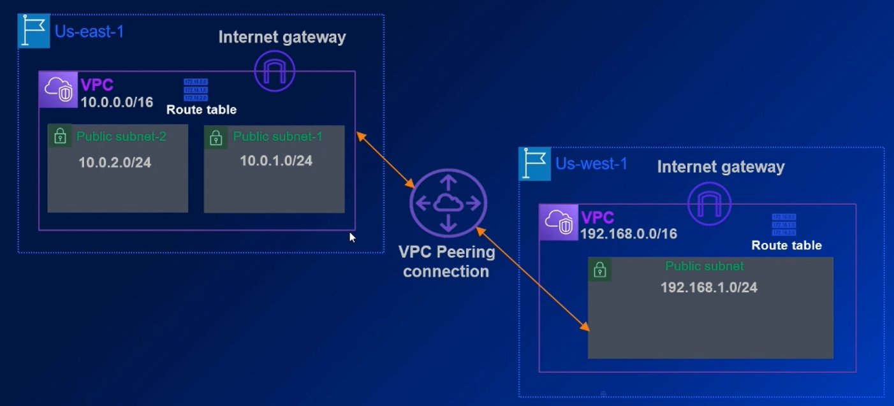
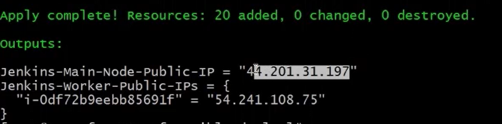

# 1. Tìm hiểu về Terraform fmt, validate, plan và apply

**Terrafrom init (initialize)** - là sự bắt đầu của tất cả các privider và các nhà dịch vụ và các plugin, các module terraform code của chúng ta để tạo ra các tài nguyên cloud (hệ thống đám mây) 
1. Khởi tạo thư mục làm việc. `Tải xuống và bao gồm tất cả các module và Provider (ngoại trừ bên thứ ba) trong Terraform file`.
2. Cần được chạy trước khi triển khai cơ sở hạ tầng. `Vì các giai đoạn khác của việc triển khai Terraform yêu cầu provider, plugins và modules, lệnh này cần phải được chạy đầu tiên`.
3. Đồng bộ hóa cấu hình, an toàn để chạy. `Lệnh **terraform init** sẽ thiết lập cấu hình backend để lưu trữ trạng thái của cơ sở hạ tầng. Nó sẽ không làm thay đổi hoặc xóa bất cứ cài đặt cấu hình hoặc trạng thái hiện tại nào, mà chỉ đồng bộ hóa cấu hình để chuẩn bị cho việc triển khai.`

**Terraform fmt (format)** - lệnh format để làm đẹp code
1. Định dạng các template. `Làm các Terraform templates trông dễ nhìn và dễ đọc`.
2. Giúp duy trì cide một cách nhất quán. `Duy trì nhất quán định dạng code, đặc biệt là nếu các nhóm phát triển đang cùng làm việc và theo dõi Terraform code thông qua việc kiểm soát phiên bản`.
3. An toàn để chạy tại mọi thời điểm. `Không thay đổi hoặc thêm bất kỳ code mới nào vào file Terraform hiện tại. Thay vào đó, nó chỉ đơn giản làm cho code hiện tại trông đẹp hơn, dễ học hơn và tuân thủ theo một định dạng chuẩn.`

**Terraform validate**
1. Kiểm tra các file cấu hình (config files). `Kiểm tra lỗi cú pháp và tính nhất quán bên trong (ví dụ: Lỗi chính tả và lỗi cấu hình tài nguyên sai)`.
2. Cần phải chạy terraform init trước. `Yêu cầu một thư mục làm việc được khởi tạo, do đó lệnh init cần được chạy trước khi validate có thể chạy`.
3. An toàn để chạy bất cứ lúc nào. `Trường hợp sử dụng là chạy lệnh này để kiểm tra vấn đề trong TF code trước khi commit vào version control`.

**Terraform plan**
1. Tạo ra kế hoạch thực thi. `Terraform tính toán sự khác biệt giữa trạng thái yêu cầu và trạng thái hiện tại để tạo ra một kế hoạch thực thi`.
2. An toàn trước khi triển khai thật.  `Đây là một bước kiểm tra để xem liệu kế hoạch thực thi phù hợp với kế hoạch mà chúng ta muốn, trước khi tạo ra hoặc sửa đổi cơ sở hạ tầng`.
3. Kế hoạch thư thi có thể được lưu lại bằng cách sử dụng tham số `-out`. `Tuy nhiên, cần phải nhận thức các cấu hình nhạy cảm cũng sẽ được lưu lại trong một file dưới dạng văn bản`.

**Terraform apply (Deploy)** - Lệnh quan trọng nhất
1. Triển khai kế hoạch thực thi! `Áp dụng các thay đổi cần thiết để đạt được trạng thái mong muốn của Terraform code`.
2. Mặc định sẽ hiển thị thông báo trước khi triển khai. `Theo mặc định, người dùng cần phải gõ "yes" một cách rõ ràng trước khi một cơ sở hạ tầng được triển khai`.
3. Sẽ hiển thị kế hoạch thự thi một lần nữa
`Terraform apply sẽ hiển thị kế hoạch (plan) thực thi một lần nữa trước khi yêu cầu triển khai thật các tài nguyên`.

# 2. Lưu trữ tạng thái (State) Terraform trong S3 backend

** **
1. Xác định cách lưu trữ trạng thái
2. Mặc định, Terraform state được lưu trữ trong Local disk
3. Các biến không thể được sử dụng trong cấu hình Backends

Ví dụ backend trong một Terraform block sử dụng S3
```terraform
terraform
{
    required_version = ">=0.12.0"
    backend "s3"
        {
            region = "us-east-1"
            profile = "default"
            key = "<arbitrary-state-file-name>"
            bucket = "<name-of-already-created-bucket>"
        }
}
```

```bash
# Tiếp tục câu lệnh nối tiếp từ bài trước
cd tf_ansible_deploy

aws s3api create-bucket --bucket <name_s3_bucket>
# {
#     "Location": "/<name_s3_bucket>"
# }

vim backend.tf # tạo file cấu hình
--- chỉnh sửa file backend.tf
terraform {
    required_version = ">=0.12.0"
    required_provider {
        aws = ">=3.0.0"
    }
}
backend "s3" {
    region = "us-east-1"
    profile = "default"
    key = "<arbitrary-state-file-name>"
    bucket = "<name-of-already-created-bucket>"
}
---

:wq # thực hiện thoát file

# Khởi tạo thư mục workspace
terraform init
# Định dạng lại các dòng code trong file backend
terraform fmt

cat backend.tf # Xem lại file Kiểm tra file xem đã dễ đọc hơn
```

# 3. Set up nhiều AWS Providers trong Terraform

Các providers thực hiện các tương tác với API của nahf cung cấp như AWS và Azure. Chúng cũng cung cấp logic để quản lý, cập nhật và tạo các tài nguyên trong Terraform.

**Khai báo nhiều nhà cung cấp AWS (AWS Providers)**
```yaml
Provider "aws"
{
    profile = var.profile
    region = var.region-master
    alias = "region-master"
}
Provider "aws"
{
    profile = var.profile
    region = var.region-worker
    alias = "region-worker"
}
```

```bash
pwd
# /root/tf_ansible_deploy

vim variable.tf
variable "profile" 
{
    type = string
    default = "default"
}
variable "region-master" 
{
    type = string
    default = "us-east-1"
}
variable "region-worker" 
{ 
    type = string
    default = "us-west-1"
}

vim provider.tf
profile "aws"
{
    profile = var.profile
    region = var.region-master
    alias = "region-master"
}
profile "aws"
{
    profile = var.profile
    region = var.region-worker
    alias = "region-worker"
}

# Chạy lệnh terraform init
terraform init
# Initializing the backend ...
ls -al # hiển thị toàn bộ thư mục (cả thư mục ẩn)

cd /.terraform
ls
# providers terraform.tfstate
cd /providers
ls
# registry.terraform.io
cd registry.terraform.io
ls
# hashicorp
cd hashicorp
...
ll
# terraform-provider-aws_v5.43.0_x5
```

# 4. Network Setup Phần 1 Triển khai VPCs, Internet GWs và Subnets
Mục đích bài học: Triển khai hệ thống mạng
Chú ý: Setup S3 Backend và nhiều AWS Providers `Đừng quên setup S3 backend và hai AWS Providers, như đã được học trong các videos của bài học trước.`

```bash
vim network.tf
# triển khai các tài nguyên network
# Create VPC in us-east-1
resource "aws_pvc" "vpc_master" {
    provider = aws.region-master # chỉ định đang sử dụng tài nguyên của AWS
    cidr_block = "10.0.0.0/16"
    enable_dns_support = true
    enable_dns_hostnames = true
    tags = {
        Name = "master-vpc-jenkins"
    }
}
# Create VPC in us-west-1
resource "aws_vpc" "vpc_master_cali" {
    provider = aws.region-worker
    cidr_block = "192.168.0.0/16"
    enable_dns_support = true
    enable_dns_hostnames = true
    tags = {
        Name = "worker-vpc-jenkins"
    } 
}
# Create IGW in us-east-1
resource "aws_internet_gateway" "igw" {
    provider = aws.region-master
    vpc_id = aws_vpc.vpc_master.id
}
# Create IGW in us-west-1
resource "aws_internet_gateway" "igw-cali" {
    provider = aws.region-worker
    vpc_id = aws_vpc.vpc_master_cali.id
}
# Get all available AZ's in VPC for master region
data "aws_availability_zones" "azs" {
    provider = aws.region-master
    state = "available"
}
# Create subnet # 1 in us-east-1
resource "aws_subnet" "subnet_1" {
    provider = aws.region-master
    availavility_zone = element(data.aws_availability_zones.azs.names, 0) # Lấy tên của AZ đầu tiên trong danh sách từ ...
    vpc_id = aws_vpc.vpc_master.id  
    cidr_block = "10.0.1.0/24"
}
# Create subnet #2 in us-east-1
resource "aws_subnet" "subnet_2" {
    provider = aws.region-master
    vpc_id = aws_vpc.vpc_master.id
    availability_zone = element(data.aws_availibility_zones.azs.names, 1)
    cidr_block = "10.0.2.0/24"
}
# Create subnet in us-west-1
resource "aws_subnet" "subnet_1_cali" {
    provider = aws.region-worker
    vpc_id = aws_vpc.vpc_master_cali.id
    cidr_block = "192.168.1.0/24"
}
# end file

terraform fmt
terraform init
terraform plan
terraform apply
```
# 5. Network Setup phần 2 triển khai Multi-Region VPC Peering
* Route table + VPC Peering

```bash
vim network.tf # edit file network

# Tạo yêu cầu kết nối VPC Peering
# Initiate Peeưring connection request from us-east-1
resource "aws_vpc_peering_connection" "useast1-uswest1" {
    provider = aws.region-master
    peer_vpc_id = aws_vpc.vpc_master_cali.id 
    vpc_id = aws_vpc.vpc_master.id
    peer_region = var.region-worker
}
# Chấp nhận VPC peering
# Accept VPC peeringf request in us-west-1 from us-east-1
resource "aws_vpc_peering_connection_accepter" "accept_peerinfg" {
    provider = aws.region-worker
    vpc_peeringf_connecrtion_id = aws_vpc_peering_connection.useast1-uswest1.id
    auto_accept = true
}

# Create route table in us-east-1
resource "aws_route_table" "internet_route" {
    provider = aws.region-master
    vpc_id = aws_vpc.vpc_master.id
    routrer {
        cidr_block = "0.0.0.0/0"
        gateway_id = aws_internet_gateway.igw.id
    }
    routrer {
        cidr_block = "192.168.1.0/24"
        vpc_peering_connection_id = aws_vpc_peering_connection.useast1-uswest1.id
    }
    lifecycle {
        ignore_changes = all
    }
    tags = {
        Name = "Master-Region-RT"
    }
}
# Overwrite default route table of VPC (Master) with our route table entries
resource "aws_main_route_table_association" "set-master-default-rt-assoc" {
    provider = aws.region-master
    vpc_id = aws_vpc.vpc_master.id
    route_table_id = aws_route_table.internet_route.id
}

# Create route table in us-west-1
resource "aws_route_table" "internet_route_cali" {
    provider = aws.region-worker
    vpc_id = aws_vpc.vpc_master_cali.id
    route {
        cidr_block = "0.0.0.0/0"
        gateway_id = aws_internet_gateway.igw-cali.id
    }
    route {
        cidr_block = "10.0.1.0/24"
        vpc_peering_connection_id = aws_vpc_peering_connection.useast1-uswest1.id
    }
    lifecycle {
        ignore_changes = all
    }
    tags {
        Name = "Worker-Region-RT"
    }
}

# Overwrite default route table of VPC(Worker) with our route table entries
resource "aws_main_route_table_association" "set-worker-default-rt-assoc" {
    provider = aws.region-master
    vpc_id = aws_vpc.vpc_master_cali.id
    route_table_id = aws_route_table.internet_route_cali.id
}
# Lưu lại file

terraform fmt
terraform validate
terraform plan
terraform apply
```
# 6. Network Setup Phần 3 Triển khai Security Groups
**Mục đích bài học**: Triển khai Security Group

Traffic từ Internet -> ALB (us-east-1)
>Inbound (TCP/80 TCP/443 -> 0.0.0.0/0) -> Outbound (All TCP -> 0.0.0.0/0)

-> Traffic và health checks cho Jenkins Master SG (Jenkins Master (us-east-1))
> Inbound (ALB->TCP/8080 TCP->Jenkins Worker) -> Outbound (All TCP -> 0.0.0.0/0)

-> TCP/22(SSH) traffic giữa Jenkins Master và Jenkins Worker SG (us-west-1)
> Inbound (TCP->Jenkins Master) -> Outbound (All TCP->0.0.0.0/0)

```bash
pwd
# /root/tf_ansible_deploy

vim security_group.tf
# Create SG for LB, on TCP/80 TCP/443 and outbound access
resource "aws_security_group" "lb-sg" {
    provider = aws.region-master
    name = "lg-sg"
    description = "Allow 443 and traffic to Jenkins SG"
    vpc_id = aws_vpc.vpc_master.id
    ingress = {
        description = "Allow 443 from anywhere"
        from_port = 443
        to_port = 443
        protocol = "tcp"
        cidr_blocks = ["0.0.0.0/0"]
    }
    ingress = {
        description = "Allow 80 from anywhere"
        from_port = 80
        to_port = 80
        protocol = "tcp"
        cidr_blocks = ["0.0.0.0/0"]
    }
    egress = { # sử dụng để cấu hình a... rule cho phép truy cập hệ thống từ bên trong mạng của chúng ta ra bên ngoài internet
        from_port = 0
        to_port = 0
        protocol = "-1"
        cidr_blocks = ["0.0.0.0/0"]
    }
}

# Create SG for allowing  TCP/8080 from * and TCP/22 from your IP in us-east-1
resource "aws_security_group" "jenkins-sg" {
    provider = aws.region-master
    name = "jenkins-sg"
    description = "Allow TCP/8080 & TCP/22"
    vpc_id = aws_vpc.vpc_master.id
    ingress {
        description = "Allow 22 from our public IP"
        from_port = 22
        to_port = 22
        protocol = "tcp"
        cidr_blocks = [var.external_ip]
    }
    ingress {
        description = "Allow anyone on port 8080"
        from_port = 8080
        to_port = 8080
        protocol = "tcp"
        security_group = [aws_security_group.lb-sg.id]
    }
    ingress {
        description = "Allow traffic from us-west-1"
        form_port = 0
        to_port = 0
        protocol = "-1"
        cidr_blocks = ["192.168.1.0/24"]
    }
    egress {
        from_port = 0
        to_port = 0
        protocol = "-1"
        cidr_blocks = ["0.0.0.0/0"]
    }
}
# exit

vim variable.tf
variable "external-ip" {
    type = string
    default = "0.0.0.0/0"
}

vim security_group.tf
# Create SG for allowing TCP/22 from your IP in us-west-2
resource "aws_security_group" "jenkins-sg-cali" {
    provider = aws.region-worker

    name = "jenkins-sg-cali"
    description = "Allow TCP/8080 & TCP/22"
    vpc_id = aws_vpc.vpc_master_cali.id
    ingress {
        description = "Allow 22 from our public IP"
        from_port = 22
        to_port = 22
        protocol = "tcp"
        cidr_blocks = [var.texternal_ip]
    }
    ingress {
        description = "Allow triffic from us-east-1"
        from_port = 0
        to_port = 0
        protocol = "-1"
        cidr_blocks = ["10.0.1.0/24"]
    }
    egress {
        from_port = 0
        to_port = 0
        protocol = "-1"
        cidr_blocks = ["0.0.0.0/0"]
    }
} 
# exit

terraform init
terraform fmt
terraform validate
terraform plan
terraform apply --auto-approve
# --auto-approve tự động chạy terraform (không cần xác nhận yes - cần cân nhắc sử dụng tham số này một cách cẩn thận)
terraform destroy # xóa toàn bộ tài nguyên

```

# 7. Lab tạo một Multi-Region Network với VPC Peering sử dụng SGs, IGW và RTs

Giới thiệu về bài thực hành này

`Việc theo dõi tất cả thành phần định tuyến khác nhau của một hệ thống mạng có thể trở nên phức tạp, đặc biệt trong môi trường mà các hoạt động IT thay đổi nhanh chóng như ngày nay. Bằng cách sử dụng Terraform để duy trì các tài nguyên AWS như VPC, SG và IGW giúp quản lý và theo dõi tất cả các sự thay đổi của tài nguyên hạ tầng hiệu quả hơn và giúp việc tự động hóa dễ dàng hơn.`

`Trong bài thực hành này, bạn sẽ thực hiện tạo một thiết lập mạng hoàn chỉnh với VPCs, subnets, security group, internet gateway và VPC Peering trong AWS sử dụng Terraform. Bạn cần có một hiểu biết nhất định về VPC và các thành phần mạng cơ bản trong AWS để có thể tận dụng linh hoạt bài lab này.`

Các bước cho bài tập thực hành:
- Giai đoạn 1: Login vào Terraform Controller Node
- Giai đoạn 2: Clone Github Repo cho Terraform Code
- Giai đoạn 3: Triển khai Terraform Code
- Giai đoạn 4: Kiểm tra các tài nguyên đã được tạo trong AWS Console. Hoàn thành bài Lab.

**Tạo một Multi-Region Network với VPC Peering sử dụng SGs, IGW, và RTs**



```bash
git clone ...

ls
# anaconda-ks.cig initial-setup-ks.cfg terraform-labs tf_ansible_deploy

cd terraform-labs/

ls
# lab_network_vpc_peering

cd /lab_network_vpc_peering

ls
# network_setup.tf output.tf variables.tf

vim network_setup.tf
vim output.tf
vim variable.tf 

terraform validate
terraform fmt
terraform plan
terraform apply

# kiểm tra thông tin trên aws console
```

# 8. Triển khai App VM phần 1 Sử dụng Data Source (SSM Parameter Store)to get AMI IDs
Link file [8.1.instances-getAMI_IDs.tf](./file/8.1%20instances-getAMI%20IDs.tf)

Triển khai App VPM phần 1: Sử dụng Data Source (SSM Parameter Store) để lấy thông tin AMI IDs 

**Mục đích của bài học: Lấy thông tin AMI IDs sử dụng SSM Parameter Store**

**Terraform Data Source cho SSM Paramter**
```yaml
data "aws_ssm_parameter" "AmazonOfficicalAMI" {
    Name = "/aws/service/ami-amazon-linux-latest/amzn2-ami-hvm-x86_64-gp2"
}
```
**->(Đầu ra) SSM Parameter Store - Parameters cho Public AMI IDs**
```yaml
{
    "Parameters": [
        {
            "Name": "/aws/service/ami-amazon-linux-latest/amzn2-ami-hvm-x86_64-gp2",
            "Type": String,
            "Value": "ami-0cd5dfb4e35928968"
        }
    ]
}
```
**-> Terraform SSM Data Source trả về AMI ID**
```yaml
data.aws_ssm_parameter.AmazonOfficialAMI.value == ami-0cd5dfb4e35928968 
```
**SSM**: được gọi là **System Manager** từ viết tắt này bắt nguồn từ tên cũ của dịch vụ này được gọi là **Sequal system manager**

Link tham khảo thêm: (https://docs.aws.amazon.com/systems-manager/latest/userguide/ssm-agent.html)

```bash
ls
# ansible.cfg aws backend.tf network.tf providers.tf security_group.tf variables.tf

# Lệnh truy suất thông tin các tham số parameter

aws ssm get-parameters-by-path --path "/aws/service/ami-amazon-linux-latest" --region us-east-1 | grep amzn2-ami-hvm-x86_64-gp2
# Xem các thông tin
# "Name": "/aws/service/ami-amazon-linux-latest/amzn2-ami-hvm-x86_64-gp2"
# "ARN": "arn:aws:ssm:us-east-1::paramter/aws/service/ami-amazon-linux-latest/amzn2-ami-hvm-x86_64-gp2"

vim instances.tf
# Get Linux AMI ID using SSM Parameter endpoint in us-easr-1
data "aws_ssm_parameter" "linuxAmi" {
    provider = aws.region-master
    name = "/aws/service/ami-amazon-linux-latest/amzn2-ami-hvm-x86_64-gp2" # end point để lấy AMI ID
}
# Get Linux AMI ID using SSM Parameter endpoint in us-west-1
data "aws_ssm_parameter" "linuxAmicali" {
    provider = aws.region-worker
    name = "/aws/service/ami-amazon-linux-latest/amzn2-ami-hvm-x86_64-gp2"
}
# end point được sử dụng giống nhau nhưng ID sẽ khác nhau phụ thuộc vào region

terraform init
terraform fmt
terraform validate
terraform plan
terraform apply

aws s3 cp s3://_url_s3 .
# download file chứa id AMI
vim file_ami
# Đọc thông tin (thông tin sẽ được truyền vào thông tin bài học trong bài học tiếp theo)
terraform destroy
 ```

# 9. Triển khai App VM phần 2 Triển khai Key Pairs cho App Nodes
Mục đích bài hoc: Triển khai Key Pairs cho App Nodes


Key Pairs sử dụng bên trong các máy ảo. Mỗi một key pairs thì bao gồm **primary key** và **public key** được sử dụng để chứng minh danh tính của chúng ta khi đăng nhập vào một máy ảo (VM). `Amazon lưu trữ dữ liệu public key máy ảo SCI và chúng ta thì lưu trữ private key trong VM của chúng ta khi chúng ta sử dụng thay vì chúng ta sử dụng password để truy cập máy ảo SCI. (Ta sử dụng private key tương ứng với public key theo mặc định được đưa vào một file gọi là autowrite trong system để chúng ta có quyền truy cập ssh vào server linux trong aws)`.

AWS có thể tạo private key cho chúng ta, hoặc chúng ta có thể tạo private key bằng cách sử dụng công cụ của bên thứ 3 hoặc ứng dụng trong linux và import key đó vào aws để sử dụng cho các EC2 của chúng ta.

```bash
ssh-keygen -t rsa
# Generating public/private rsa key pair.
# Enter file in which to save the key (/root/.ssh/id_rsa):
# ENTER
# ENTER 

ls .ssh/
# id_rsa id_rsa.pub 

vim instances.tf
# Create key-pair for logging into EC2 in us-east-1
resource "aws_key_pair" "master-key" {
    provider = aws.region-master
    key_name = "jenkins"
    public_key = file("~/.ssh/id_rsa.pub")
}
# Create key-pair for logging into EC2 in us-west-1
resource "aws_key_pair" "worker-key" {
    provider = aws.region-worker 
    key_name = "jenkins"
    public_key = file("~/.ssh/id_rsa.pub")
}

terraform init
terraform fmt
terraform validate
terraform plan
terraform apply
terraform destroy --auto-approve
```

# 10. Triển khai App VM phần 3 Triển khai Jenkins Master và Worker Instance
**Mục tiêu**: tạo các máy ảo để các ứng dụng của chúng ta được cài đặt trong các ứng dụng AWS. Cũng là để chúng ta kiểm tra xem có thể sử dụng EC2 Key Pairs mà chúng ta đã tạo. Để chúng ta có thể ssh truy cập vào các máy ảo EC2.


```bash
ls
# ansible.cfg aws backend.tf intances.tf networks.tf providers.tf sercurity_groups.tf terraformstatefile variables.tf

vim instances.tf
# Create and bootstrap EC2 in us-east-1
resource "aws_instance" "jenkins-master" {
    provider = aws.region-master
    ami = data.aws_ssm_parameter.linuxAmi.value
    instance_type = var.instance-type
    key_name = aws_key_pair.master-key.key-name
    associate_public_ip_address = true
    vpc_security_group_ids = [aws_security_group.jenkins-sg.id]
    subnet_id = aws_subnet.subnet_1.id

    tags = {
        Name = "jenkins_master_tf"
    }

    depends_on = [aws_main_route_table_association.set-master-default-rt-assoc]
}

# Create EC2 in us-west-1
resource "aws_instance" "jenkins-worker-cali" {
    provider = aws.region-worker
    count = var.workers-count
    ami = data.aws_ssm_parameter.linuxAmicali.value
    instance_type = var.instance-type
    key_name = aws_key_pair.worker-key.key_name
    associate_public_ip_address = true
    vpc_security_group_ids = [aws_security_group.jenkins-sg-cali.id]
    subnet_id = aws_subnet.subnet_1_cali.id

    tags = {
        Name = join("_", ["jenkins_worker_tf", count.index + 1])
    }
    depends_on = [aws_main_route_table_association.set-worker-default-rt-assoc, aws_instance.jenkins-master]
}

vim variables.tf

variable "workers-count" {
    type = number
    default = 1
}

variable "instance-type" {
    type = string
    default = "t3.micro"
}

# Thông tin địa chỉ IP public EC2
vim output.tf
output "Jenkins-Main-Node-Public-IP" {
    value = aws_instance.jenkins-master.public_ip
}

output "Jenkins-worker-Public-IPs" {
    value = {
        for instance in aws_instance.jenkins-worker-cali : instance.id => instance.public_ip
    }
}
# Cách hoạt động: Định nghĩa output và đặt tên mô tả cho tài nguyên ta muốn cho phép output ra. Sau đó, cái giá trị output sẽ được hiển thị ra cho chúng ta thấy kết quả.

# map(or object): a group of values identified by named labels, like {name = "Mabel", age = 52}. 
# list(or tuple): a sequence of values, like ["us-east-la", "us-wesr-lc"]. Identify elements in a list with consecutive whole numbers, starting with zero.

terraform fmt
terraform init
terraform validate
terraform plan
terraform apply

ssh ec2-user@44.210.31.197
# login ko cần sử dụng password
ssh ec2-user@54.241.108.75
# Tương tự như trên
...
sudo yum update # ví dụ update máy chủ

terraform destroy
```
